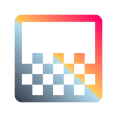

<a name="readme-top"></a>


<div align="center">

[![Stargazers][stars-shield]][stars-url]
[![Issues][issues-shield]][issues-url]
[![MIT License][license-shield]][license-url]
[![LinkedIn][linkedin-shield]][linkedin-url]

</div>


<!-- PROJECT LOGO -->
<br />
<div align="center">
  <a href="https://github.com/JohnnyLeek1/React-Mesh-Gradient">
    
  </a>

<h3 align="center">React Mesh Gradient</h3>

  <p align="center">
    Create beautiful and interactive gradients with React.JS
    <br />
    <a href="https://github.com/JohnnyLeek1/React-Mesh-Gradient"><strong>Explore the docs »</strong></a>
    <br />
    <br />
    <a href="https://codesandbox.io/p/sandbox/purple-worker-hur815?file=%2Fsrc%2FApp.tsx">View Demo</a>
    ·
    <a href="https://github.com/JohnnyLeek1/React-Mesh-Gradient/issues">Report Bug</a>
    ·
    <a href="https://github.com/JohnnyLeek1/React-Mesh-Gradient/issues">Request Feature</a>
  </p>
</div>


<!-- TABLE OF CONTENTS -->
<details>
  <summary>Table of Contents</summary>
  <ol>
    <li>
      <a href="#about-the-project">About The Project</a>
      <ul>
        <li><a href="#built-with">Built With</a></li>
      </ul>
    </li>
    <li>
      <a href="#getting-started">Getting Started</a>
      <ul>
        <li><a href="#prerequisites">Prerequisites</a></li>
        <li><a href="#installation">Installation</a></li>
      </ul>
    </li>
    <li>
        <a href="#usage">Usage</a>
        <ul>
            <li><a href="#wireframe-mode">Wireframe mode</a></li>
            <li><a href="#adding-interactivity">Adding interactivity</a></li>
            <li><a href="#custom-pointer-events">Custom Pointer Events</a></li>
        </ul>
    </li>
    <li><a href="#current-props-available">Current props available</li>
    <li><a href="#roadmap">Roadmap</a></li>
    <li><a href="#contributing">Contributing</a></li>
    <li><a href="#license">License</a></li>
    <li><a href="#contact">Contact</a></li>
    <li><a href="#acknowledgments">Acknowledgments</a></li>
  </ol>
</details>

<br />


<!-- ABOUT THE PROJECT -->
## About The Project

![Example of a Wireframe Mesh Gradient][product-screenshot]
![Example of a regular gradient][product-screenshot2]

<p align="right">(<a href="#readme-top">back to top</a>)</p>


### Built Using:
<br />

[![React][React.js]][React-url]
[![Three][Three.JS]][Three-url]
[![Vite][Vite-Badge]][Vite-url]
[![Rollup][Rollup-Badge]][Rollup-url]


<p align="right">(<a href="#readme-top">back to top</a>)</p>


<!-- GETTING STARTED -->
## Getting Started

Utilizing React Mesh Gradient is incredibly simple. Simply install the package and you can begin using the renderer in any of your components

### Prerequisites

* npm
  ```sh
  npm install npm@latest -g
  ```

### Installation

1. Install the package
   ```sh
   npm install @johnn-e/React-Mesh-Gradient
   ```
2. In the jsx/tsx file you wish to include the gradient:
   ```tsx
   import { MeshGradientRenderer } from '@johnn-e/react-mesh-gradient';

   function App() {
    <MeshGradientRenderer
        className="gradient"
        colors={[
            "#C3E4FF", 
            "#6EC3F4", 
            "#EAE2FF", 
            "#B9BEFF", 
            "#B3B8F9"
        ]}
    />
   } 
   ```

<p align="right">(<a href="#readme-top">back to top</a>)</p>


<!-- USAGE EXAMPLES -->
## Usage

There are a few different ways to use React Mesh Gradient. You have complete control over which colors are used, the speed of the gradient, and how it presents itself.

### Wireframe mode

A cool way to present the gradient is to display the gradient as a wireframe. This gives the gradient an incredible 3D look.

```tsx
const Gradient = () => {
    return (
        <MeshGradientRenderer
            colors={[
                "#C3E4FF", 
                "#6EC3F4", 
                "#EAE2FF", 
                "#B9BEFF", 
                "#B3B8F9"
            ]}
            wireframe={true}
        />
    );
}
```

### Adding interactivity

All of the props on the gradient can be set to state variables which allows them to become interactive and change based on external input.

Here, we toggle wireframe mode everytime a user clicks a button:

```tsx
import { useState } from 'react';

const ToggleWireframeGradient = () => {
    const [isWireframe, setIsWireframe] = useState(false);

    return (
        <div>
            <MeshGradientRenderer
                colors={[
                    "#C3E4FF", 
                    "#6EC3F4", 
                    "#EAE2FF", 
                    "#B9BEFF", 
                    "#B3B8F9"
                ]}
            />
            <button onClick={() => setIsWireframe(!isWireframe)}>Toggle Wireframe</button>
        </div>
    );
}
```

### Custom Pointer Events

The Gradient Renderer exposes various pointer events for you to use to cause various interactions with the gradient. These events are:

* `onGradientClick`
* `onGradientContextMenu`
* `onGradientDoubleClick`
* `onGradientWheel`
* `onGradientPointerUp`
* `onGradientPointerDown`
* `onGradientPointerOver`
* `onGradientPointerOut`
* `onGradientPointerEnter`
* `onGradientPointerLeave`
* `onGradientPropsUpdate`
* `onGradientPointerMove`

These event functions are passed the `THREE.Event` that occurs on these events, along with data from the native browser event. 

Using these functions, we can do things like cycle between colors when a user clicks the gradient

```tsx
const GradientClick = () => {
    const palettes = [
        ["#F9B409", "#F9D16A", "#2A687A", "#72A25E", "#C3B49E"],
        ["#C3E4FF", "#6EC3F4", "#EAE2FF", "#B9BEFF", "#B3B8F9"],
        ["#69D2E7", "#A7DBD8", "#E0E4CC", "#F38630", "#FA6900"],
        ["#FE4365", "#FC9D9A", "#F9CDAD", "#C8C8A9", "#83AF9B"]
  ];

  const [colorIndex, setColorIndex] = useState(0);

  return (
    <MeshGradientRenderer
        colors={palettes[colorIndex]}
        onGradientClick={() => setColorIndex(colorIndex === palettes.length - 1 ? 0 : colorIndex + 1)}
    />
  )
}
```

_For more examples, please refer to the [Documentation]()_ (coming soon)

<p align="right">(<a href="#readme-top">back to top</a>)</p>

## Current props available

`colors` (required) - Array of colors to use represented as a hex string.

`wireframe` - Whether or not the gradient should be rendered in wireframe mode.

`speed` - The speed at which the gradient should move. The speed should be a number between 0 and 1.

`backgroundColor` - The background color of the gradient. The color should be in hex string.

`backgroundOpacity` - The opacity of the background. The opacity should be a number between 0 and 1.

`onGradientClick` - Click handler for the gradient. Will be called with the native Three.JS Event object.

`onGradientContextMenu` - Context menu handler for the gradient. Will be called with the native Three.JS Event object.

`onGradientDoubleClick` - Double click handler for the gradient. Will be called with the native Three.JS Event object.

`onGradientWheel` - Wheel handler for the gradient. Will be called with the native Three.JS Event object.

`onGradientPointerUp` - Pointer up handler for the gradient. Will be called with the native Three.JS Event object.

`onGradientPointerDown` - Pointer down handler for the gradient. Will be called with the native Three.JS Event object.

`onGradientPointerOver` - Pointer over handler for the gradient. Will be called with the native Three.JS Event object.

`onGradientPointerOut` - Pointer out handler for the gradient. Will be called with the native Three.JS Event object.

`onGradientPointerEnter` - Pointer enter handler for the gradient. Will be called with the native Three.JS Event object.

`onGradientPointerLeave` - Pointer leave handler for the gradient. Will be called with the native Three.JS Event object.

`onGradientPointerMove` - Pointer move handler for the gradient. Will be called with the native Three.JS Event object.

`onGradientPropsUpdate` - Update handler for the gradient. Will be called with the native Three.JS Event object.

<p align="right">(<a href="#readme-top">back to top</a>)</p>


<!-- ROADMAP -->
## Roadmap

- [ ] Work on reducing bundle size
- [ ] Allow for a customizable # of colors (right now you _must_ use 5)


See the [open issues](https://github.com/JohnnyLeek1/React-Mesh-Gradient/issues) for a full list of proposed features (and known issues).

<p align="right">(<a href="#readme-top">back to top</a>)</p>

<!-- CONTRIBUTING -->
## Contributing

Contributions are what make the open source community such an amazing place to learn, inspire, and create. Any contributions you make are **greatly appreciated**.

If you have a suggestion that would make this better, please fork the repo and create a pull request. You can also simply open an issue with the tag "enhancement".
Don't forget to give the project a star! Thanks again!

1. Fork the Project
2. Create your Feature Branch (`git checkout -b feature/AmazingFeature`)
3. Commit your Changes (`git commit -m 'Add some AmazingFeature'`)
4. Push to the Branch (`git push origin feature/AmazingFeature`)
5. Open a Pull Request

<p align="right">(<a href="#readme-top">back to top</a>)</p>


<!-- LICENSE -->
## License

Distributed under the MIT License. See `LICENSE.txt` for more information.

<p align="right">(<a href="#readme-top">back to top</a>)</p>


<!-- CONTACT -->
## Contact

Johnny Leek - [LinkedIn][linkedin-url]

Project Link: [https://github.com/JohnnyLeek1/React-Mesh-Gradient](https://github.com/JohnnyLeek1/React-Mesh-Gradient)

<p align="right">(<a href="#readme-top">back to top</a>)</p>


<!-- ACKNOWLEDGMENTS -->
## Acknowledgments

* [React Three Fiber](https://docs.pmnd.rs/react-three-fiber/getting-started/introduction)
* Yuri Artiukh for the inspiration and shader tutorials

<p align="right">(<a href="#readme-top">back to top</a>)</p>


<!-- MARKDOWN LINKS & IMAGES -->
<!-- https://www.markdownguide.org/basic-syntax/#reference-style-links -->
[contributors-shield]: https://img.shields.io/github/contributors/JohnnyLeek1/React-Mesh-Gradient.svg?style=for-the-badge
[contributors-url]: https://github.com/JohnnyLeek1/React-Mesh-Gradient/graphs/contributors
[forks-shield]: https://img.shields.io/github/forks/JohnnyLeek1/React-Mesh-Gradient.svg?style=for-the-badge
[forks-url]: https://github.com/JohnnyLeek1/React-Mesh-Gradient/network/members
[stars-shield]: https://img.shields.io/github/stars/JohnnyLeek1/React-Mesh-Gradient.svg?style=for-the-badge
[stars-url]: https://github.com/JohnnyLeek1/React-Mesh-Gradient/stargazers
[issues-shield]: https://img.shields.io/github/issues/JohnnyLeek1/React-Mesh-Gradient.svg?style=for-the-badge
[issues-url]: https://github.com/JohnnyLeek1/React-Mesh-Gradient/issues
[license-shield]: https://img.shields.io/github/license/JohnnyLeek1/React-Mesh-Gradient.svg?style=for-the-badge
[license-url]: https://github.com/JohnnyLeek1/React-Mesh-Gradient/blob/master/LICENSE.txt
[linkedin-shield]: https://img.shields.io/badge/-LinkedIn-black.svg?style=for-the-badge&logo=linkedin&colorB=555
[linkedin-url]: https://linkedin.com/in/johnny-leek
[product-screenshot]: https://i.imgur.com/uiAtYHB.png
[product-screenshot2]: https://i.imgur.com/NdfFwqB.png
[React.js]: https://img.shields.io/badge/React-20232A?style=for-the-badge&logo=react&logoColor=61DAFB
[React-url]: https://reactjs.org/
[Three.JS]: https://img.shields.io/badge/threejs-black?style=for-the-badge&logo=three.js&logoColor=white
[Three-url]: https://threejs.org/
[Vite-Badge]: https://img.shields.io/badge/vite-%23646CFF.svg?style=for-the-badge&logo=vite&logoColor=white
[Vite-url]: https://vitejs.dev/
[Rollup-Badge]: https://img.shields.io/badge/RollupJS-ef3335?style=for-the-badge&logo=rollup.js&logoColor=white
[Rollup-url]: https://rollupjs.org/
[Sandbox-Link]: https://codesandbox.io/p/sandbox/purple-worker-hur815?file=%2Fsrc%2FApp.tsx

<!-- 
    README Template taken from / inspired by 
    https://github.com/othneildrew/Best-README-Template
-->